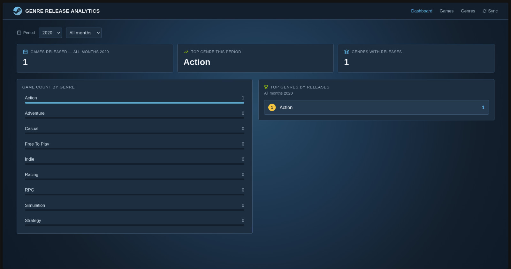
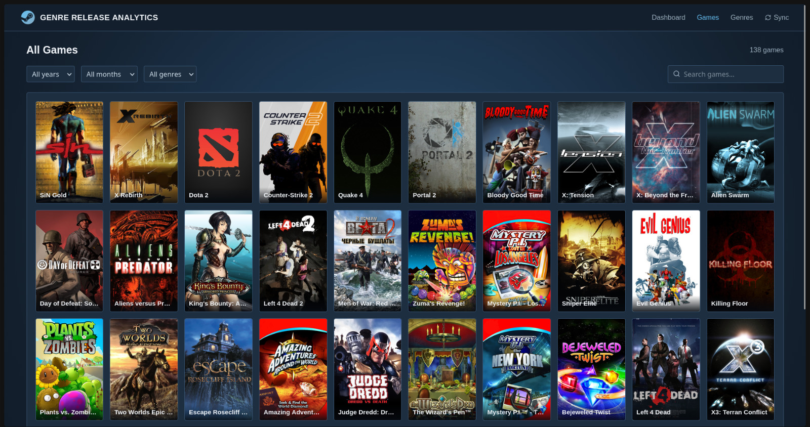
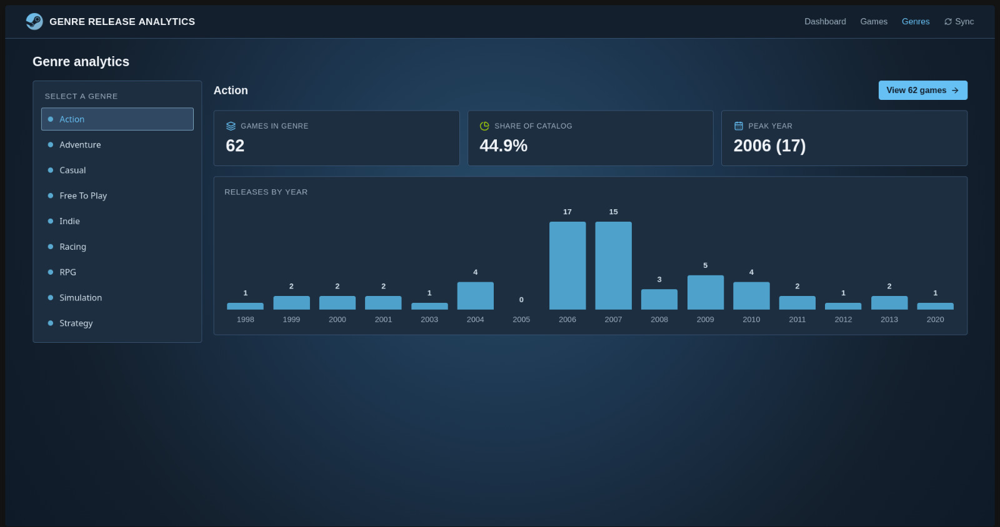

# Steam Analytics Dashboard

A full-stack web application that fetches game data from the Steam store and displays analytics by genre and release date. Built as a personal learning project to practice TypeScript, REST APIs, and PostgreSQL.

## Screenshots

### Dashboard


### Games List


### Genre Analytics


## What it does

- Syncs game data from the Steam API and stores it in a PostgreSQL database
- Displays a dashboard with game release counts broken down by genre and year/month
- Lets you browse the full games list with filters (year, month, genre, search)
- Shows genre-level breakdowns on a dedicated genres page
- Includes an admin panel to manually trigger Steam sync and check sync status

## Tech Stack

**Frontend**
- React 19 + TypeScript
- Vite
- React Router

**Backend**
- Node.js + Express 5
- TypeScript
- Prisma ORM + PostgreSQL

**Infrastructure**
- npm workspaces (monorepo)
- Docker (local PostgreSQL)

## Project Structure

```
steam-analytics-dashboard/
├── frontend/          # React app (Vite)
├── backend/           # Express API server
├── packages/
│   └── database/      # Prisma schema and config
├── docs/
│   └── screenshots/   # App screenshots for README
├── docker-compose.yml # Local PostgreSQL
└── package.json       # Workspace root
```

## Getting Started

### Prerequisites

- Node.js >= 18
- Docker (for local database)

### 1. Install dependencies

```bash
npm install
```

### 2. Set up the database

Copy the example Docker Compose file and fill in your own values:

```bash
cp docker-compose-example.yml docker-compose.yml
```

Edit `docker-compose.yml` and set your preferred `POSTGRES_USER`, `POSTGRES_PASSWORD`, and `POSTGRES_DB`.

Then start the container:

```bash
docker compose up -d
```

Create the `packages/database/.env` file:

```env
# Database — must match the values in your docker-compose.yml
DATABASE_URL="postgresql://<POSTGRES_USER>:<POSTGRES_PASSWORD>@localhost:5432/<POSTGRES_DB>"

# Steam Web API key — get one at https://steamcommunity.com/dev/apikey
STEAM_API_KEY="your_steam_api_key_here"

# SteamGridDB API key — get one at https://www.steamgriddb.com/api/v2
STEAMGRIDDB_API_KEY="your_steamgriddb_api_key_here"
```

Run Prisma migrations:

```bash
cd packages/database
npx prisma migrate dev
```


### 3. Run the backend

```bash
npm run dev:backend
```

The API will be available at `http://localhost:3000`.

### 4. Run the frontend

```bash
npm run dev:frontend
```

The app will be available at `http://localhost:5173`.

## API Endpoints

| Method | Path | Description |
|--------|------|-------------|
| GET | `/api/years` | List of years with game data |
| GET | `/api/months?year=` | Months with data for a given year |
| GET | `/api/genres` | All genres |
| GET | `/api/games` | Paginated game list (supports year, month, genre, search filters) |
| GET | `/api/analytics/releases-by-genre` | Game counts grouped by genre |
| POST | `/api/admin/sync-steam` | Trigger a Steam data sync |
| GET | `/api/admin/sync-status` | Check the status of the last sync |

## Notes

- The first sync can take a while depending on how many games are in the Steam store
- Game grid images are fetched directly from Steam's CDN at display time
- Sync runs are tracked in the database (start time, finish time, counts, errors)
